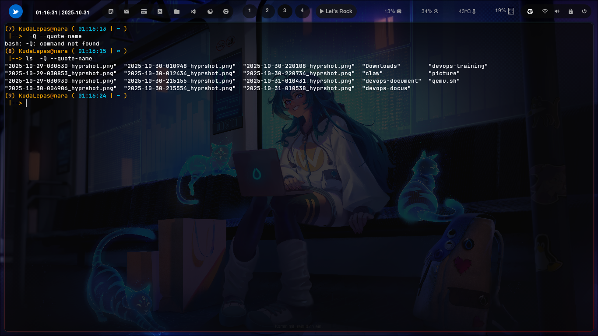

### ``` ls -Q --quote-name ```


### Cara penggunaan 


digunakan untuk menampilkan nama file atau direktori dengan tanda kutip ganda (") di sekelilingnya.

Tujuannya adalah agar nama file yang berisi spasi, tab, atau karakter khusus tetap terbaca jelas dan tidak membingungkan shell atau pengguna.


