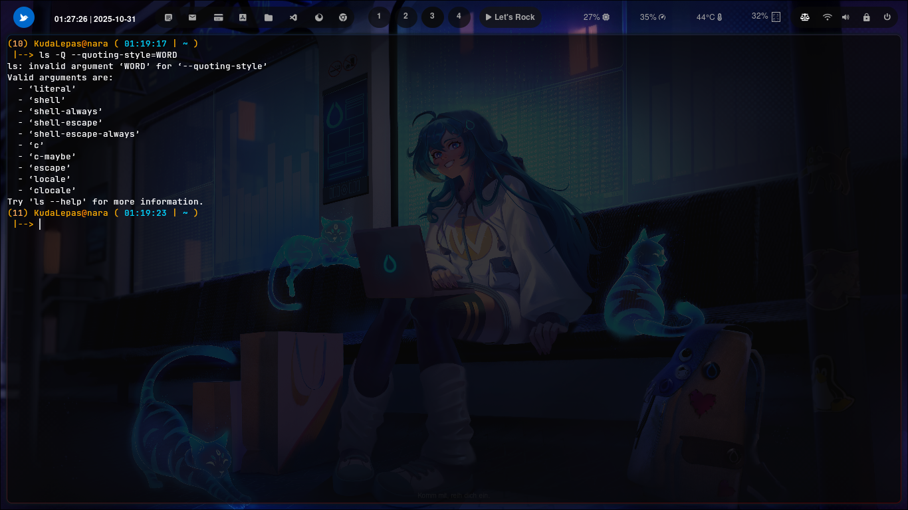

### ``` -Q --quoting-style=WORD ```


### Cara penggunaan 


Memberi kontrol lebih luas terhadap gaya kutipan yang digunakan oleh ls.

Nilai WORD bisa diganti dengan salah satu mode berikut:

Perintah ls -Q atau ls --quoting-style=WORD pada sistem operasi berbasis Unix/Linux berfungsi untuk mengatur cara penampilan nama file dalam output perintah ls, khususnya dalam hal penanganan karakter khusus seperti spasi, tanda kutip, atau karakter yang tidak dapat dicetak. Opsi -Q (atau --quote-name) secara spesifik akan menampilkan setiap nama file dan direktori dengan diapit tanda kutip ganda (")


