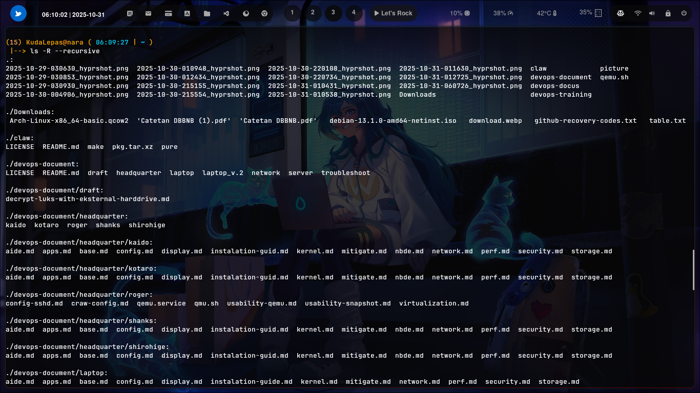

### ``` -R --recursive ```


### Cara penggunaan 


berfungsi untuk menampilkan isi direktori secara rekursif, yaitu menampilkan seluruh file dan subdirektori yang terdapat di dalam direktori utama beserta isi di dalamnya, hingga ke tingkat terdalam. Dengan kata lain, perintah ini tidak hanya menampilkan isi dari direktori saat ini, tetapi juga secara otomatis menelusuri dan menampilkan isi dari semua subdirektori yang ada di dalamnya.


