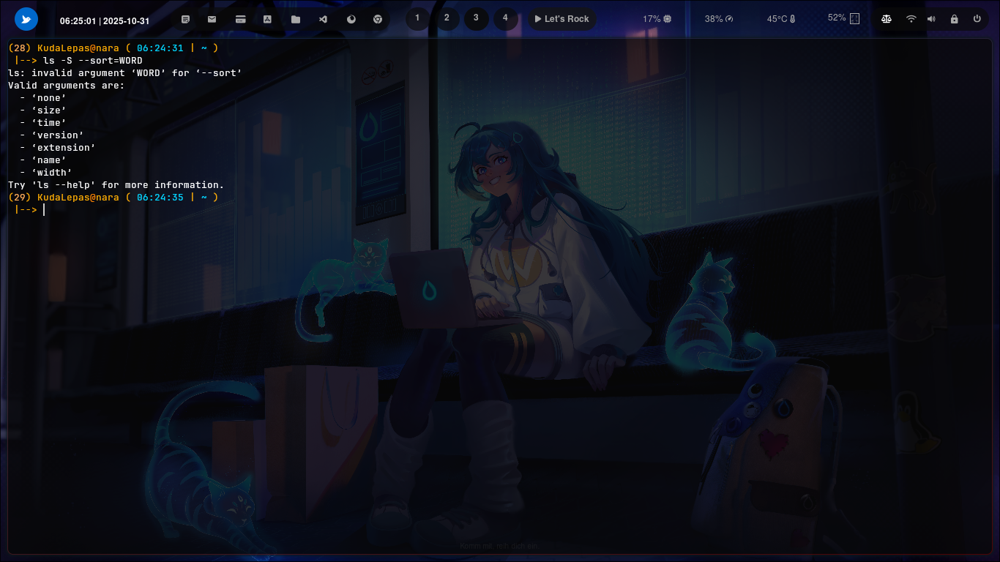

### ``` -S --sort=WORD ```


### Cara penggunaan 


ls `--sort=WORD pada` sistem operasi Unix/Linux digunakan untuk mengatur urutan (sort order) tampilan daftar file dan direktori berdasarkan kriteria tertentu.

Secara default, ls menampilkan file berdasarkan urutan abjad (alphabetical order). Namun, dengan opsi `--sort=WORD`, pengguna dapat menentukan cara pengurutan file sesuai kebutuhan — misalnya berdasarkan ukuran, waktu, ekstensi, atau versi.


