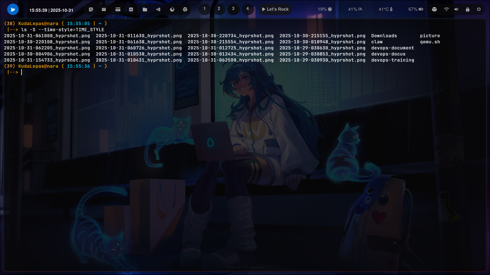

### ``` -S --time-style=TIME_STYLE ```


### Cara penggunaan 


berfungsi untuk untuk merupakan kombinasi dua opsi yang mengatur pengurutan file berdasarkan ukuran dan format tampilan waktu (timestamp) pada output perintah ls.


