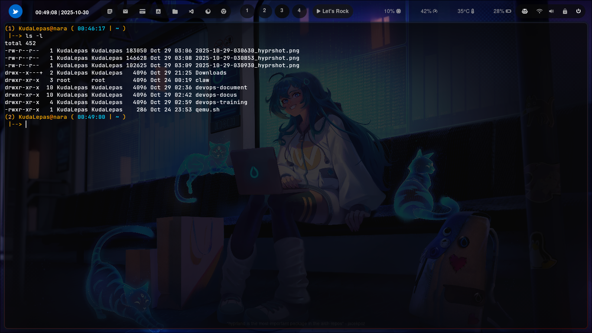

### ``` ls -l ```


### Cara penggunaan 


fungsi ls -l adalah untuk menampilkan daftar file dan direktori dalam format panjang yang berisi:

- Jenis file dan permission (izin akses)

- Jumlah link (hard link)

- Pemilik (owner)

- Grup pemilik (group)

- Ukuran file (dalam byte)

- Waktu modifikasi terakhir

- Nama file/direktori


