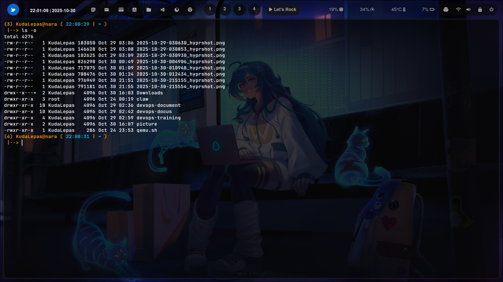

### ``` ls -o ```


### Cara penggunaan 


command ini di gunakan pada sistem operasi berbasis Linux untuk menampilkan daftar file secara panjang (long listing) seperti ls -l, tetapi tanpa menampilkan kolom grup (group name).


