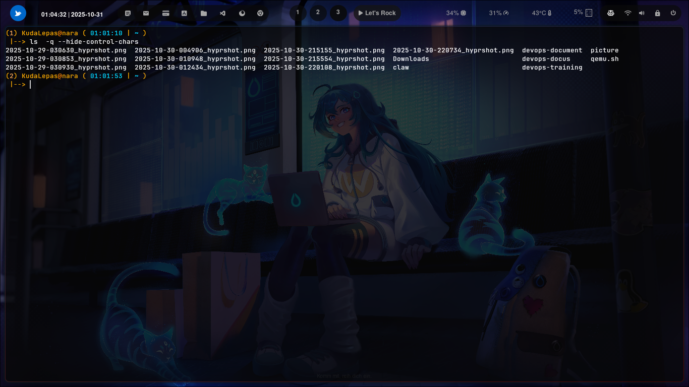

### ``` -q --hide-control-chars ```


### Cara penggunaan 


command ini di gunakan pada sistem operasi berbasis Linux untuk menyembunyikan karakter kontrol atau karakter yang tidak dapat dicetak dalam nama file, dengan cara menggantikannya dengan tanda tanya


