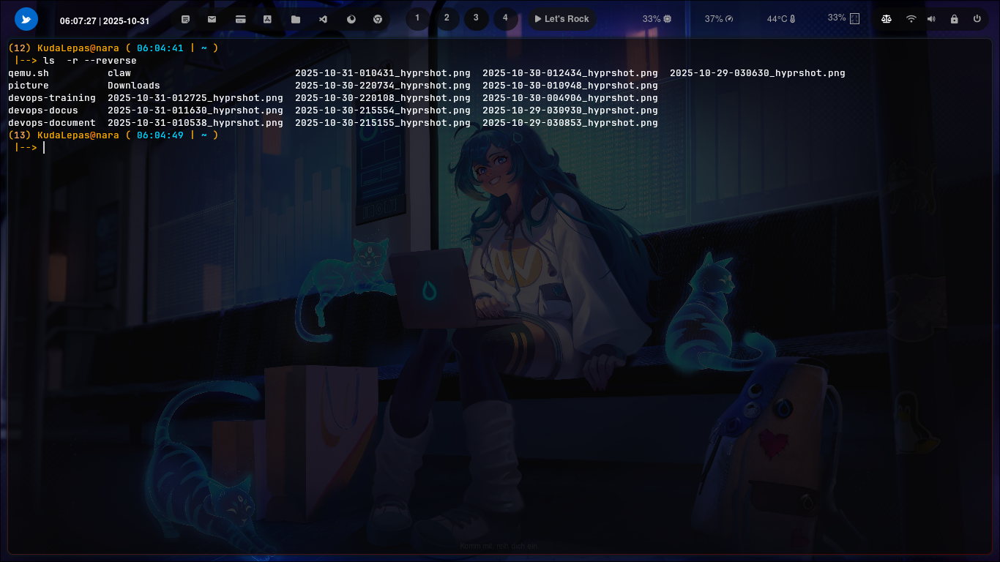

### ``` -r --reverse ```


### Cara penggunaan 


berfungsi untuk membalik urutan tampilan daftar file dan direktori yang dihasilkan oleh perintah ls. Secara default, ls menampilkan daftar file berdasarkan urutan abjad (alphabetical order) dari nama file atau direktori. Dengan menambahkan opsi -r atau --reverse, urutan ini dibalik, sehingga file yang biasanya muncul di bagian akhir akan muncul di bagian awal, dan sebaliknya.


