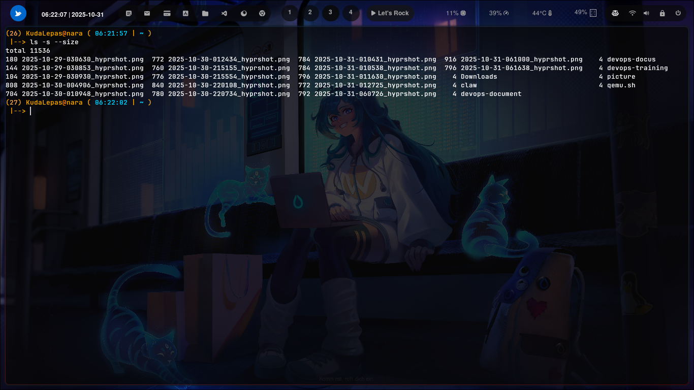

### ``` -s --size ```


### Cara penggunaan 


berfungsi untuk untuk menampilkan ukuran file dalam satuan blok (block size) di sisi kiri setiap nama file pada output ls. Dengan kata lain, opsi ini menambahkan kolom angka yang menunjukkan berapa banyak blok disk yang digunakan oleh masing-masing file atau direktori di sistem penyimpanan.


